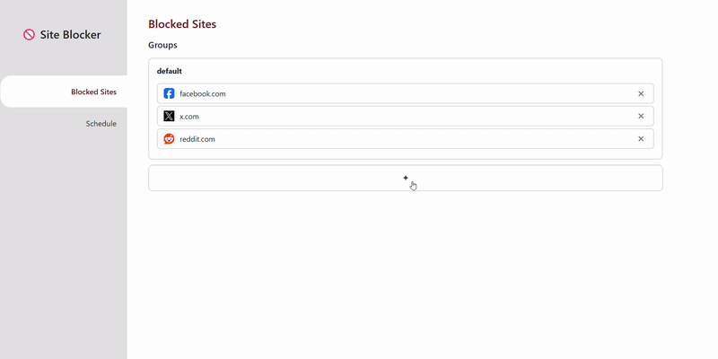
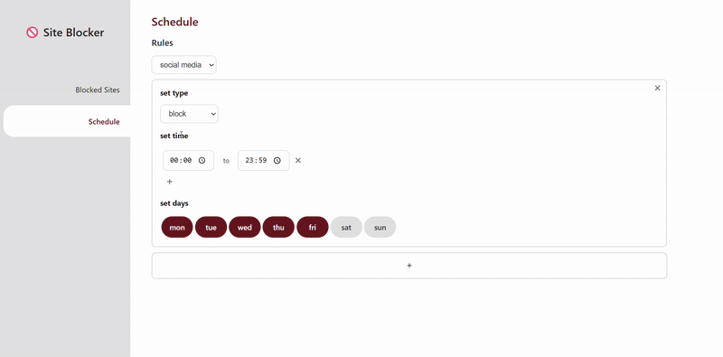
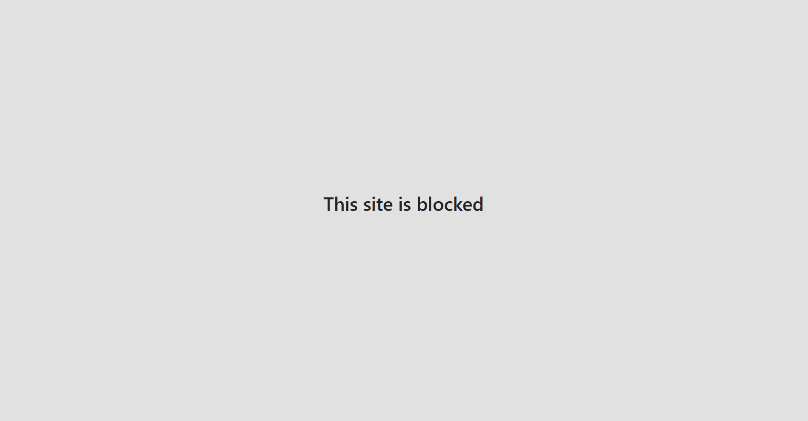
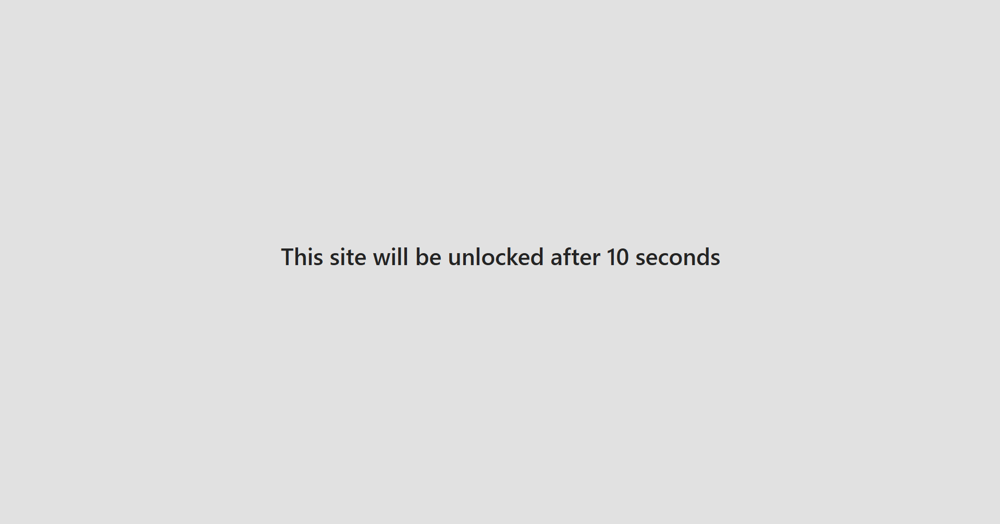

# Site Blocker

A Chrome extension for **blocking access to chosen websites** with delay gratification, grayscale filter, and customizable rules.

## Features

- Block specific websites based on hostname
- Apply different rules based on time and day
- Delay access to websites or apply a grayscale filter

# Preview

## Installation

1. Clone this repository
2. Open Chrome and go to chrome://extensions/
3. Enable Developer mode
4. Click Load unpacked and select the cloned folder
5. The extension will appear in your toolbar

## Template & Libraries

- **Base template:** [Chrome Extension React Template](https://github.com/5tigerjelly/chrome-extension-react-template)  
- **Drag-and-drop functionality:** [dnd-kit tutorial](https://www.youtube.com/watch?v=RG-3R6Pu_Ik)

## License
MIT License